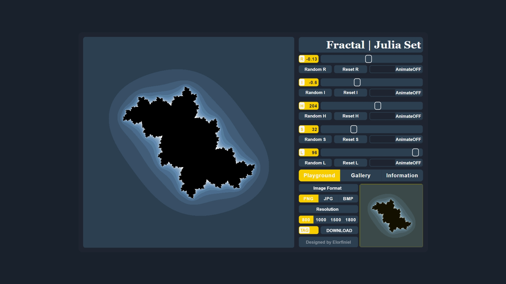

# Julia Set Visualizer: Unleash the Power of Fractals

🌀 Explore **the Beauty of the Julia Set** in the Complex Plane.

Welcome to the Julia Set Visualizer, an interactive webpage designed to immerse you in the mesmerizing world of fractals. Named after Gaston Julia, the Julia set is a captivating mathematical concept that comes to life through this web-based visualization, where you can explore the intricate beauty of fractals on the complex plane. This interactive tool empowers you to dynamically shape and mold Julia Sets by manipulating key parameters. Immerse yourself in the artistry of mathematics and unleash your creativity!

## Features

- 🎨 Adjust Colors: Customize the color palette to your liking.
- ⚙️ Modify Constants: Experiment with the complex number "C" to see how it influences the shape of the Julia set.
- 🔄 Zoom and Pan: Dive deeper into the details by zooming and panning across the complex plane.
- 📷 Capture Screenshots: Share your favorite Julia set configurations with the community.

## Usage

Clone this repository, double click `source/JuliaFinalCut.html`, experience the magic directly in your browser.

## Parameter Control

- Real and Imaginary Parts (R and I): Define the Julia Complex Constant (C) by adjusting the real and imaginary components.
- Hue, Saturation, and Lightness (H, S, L): Customize the color palette of your Julia Set to your liking.

## Parameter Adjustment

- Use the sliders for precise control.
- Toggle switches to randomize, reset, or animate specific parameters.
- Use intuitive keyboard shortcuts for seamless navigation and manipulation.

## Keyboard Shortcuts

#### Viewport Navigation

  | Key | Function                    |
  | --- | --------------------------- |
  | W   | Move viewport upward        |
  | A   | Move viewport towards left  |
  | S   | Move viewport downward      |
  | D   | Move viewport towards right |

#### Zooming

  | Key | Function  |
  | --- | --------- |
  | I   | Zoom in   |
  | O   | Zoom out  |

#### Miscellaneous

  | Key   | Function                     |
  | ---   | ---------------------------- |
  | C     | Reset viewport               |
  | E     | Randomize all parameters     |
  | F     | Reset all parameters         |
  | M     | Display the complete image   |

#### Gallery Image

  | Key   | Function                     |
  | ---   | ---------------------------- |
  | [NUM] | Render gallery image         |

Embark on a visual journey by adjusting parameters, exploring color variations, and discovering the enchanting world of Julia Sets. Happy exploring!

## Examples

| C = -0.20 + 0.60i | C = -1.31 + 0.50i | C = 0.27 + 0.02i |
| -------------- | -------------- | -------------- |
| _12_27_16.png) | _12_26_00.png) | _12_24_15.png) |

## Tech Stack

- **HTML, CSS, JavaScript**: The fundamental technologies powering this interactive Julia Set visualizer.
- **Canvas API**: Employed for rendering intricate fractal patterns on the complex plane.

## Disclaimer

This Julia Set Visualizer was developed at an early stage of my programming career. It contains aspects of design and coding styles that may not adhere to best practices. This repository is intended for fun and exploration, serving as a snapshot of my learning journey rather than a dedicated role-model project for others to learn from.

**Note**: As of now, I won't be actively responding to issues or making further improvements to the code. Feel free to explore and experiment, keeping in mind the context of its development.
